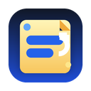

  
  <h1>Recall Sticker 📝</h1>
  
<b>Turning your reading into active recall, in-situ.</b>

  
不在别处，就在原地。用“主动回忆”替代“被动高亮”的划词记忆插件。

 

## 📖 为什么做这个插件？(The Problem)

大多数人在阅读硬核长文时，喜欢用荧光笔（Highlight）画线。
但这往往只是给了我们一种**“我知道了”的错觉**。几天后重读时，高亮的内容直接映入眼帘，大脑没有经过“提取”的挣扎，最终什么也没记住。

**Recall Sticker** 换了一种思路：
与其划重点，不如**把重点挖空遮住**。当你再次滑到这里时，你必须主动回想（Active Recall）底层盖住的是什么词，点击后才能核对答案。

它不是一个稍后阅读工具，也不是一个脱离了原文语境的死板抽卡软件。**它把整个互联网网页变成了你的动态填空题库。**

---

## ✨ 核心特征 (What Customers Get)

1. 🖍️ **原地遮挡贴纸**：选中文字，立刻生成一张模糊贴纸。没有弹窗，不打断心流。
2. 🎯 **精准的锚点还原**：即使页面上有无数个相同的单词，通过特有的 `前后文（Prefix/Suffix）特征匹配算法`，重新打开网页时也能精准贴回它原来的位置。
3. ⌨️ **键盘极客友好**：按 `Tab` 键即可在贴纸间切换焦点，按 `Space` 或 `Enter` 揭开谜底。
4. 👁️ **全局偷看模式**：死活想不起来？按住键盘的 `Alt` (或 `Option`) 键，立刻全屏透视所有答案。
5. 📥 **无缝接轨 Anki**：智能抓取你挖空词汇所在的“完整句子”作为上下文，一键导出为标准 Anki Cloze 格式（CSV）。
6. 🗂️ **侧边栏指挥中心**：在 Chrome 自带的侧边栏中浏览你所有的记忆碎片，点击后利用原生的 Text Fragments 技术瞬间跳回原文对应的位置。

---

## 🚀 如何安装食用

当前为本地解压版（Manifest V3 标准）：

1. 打开 Chrome / Edge 浏览器，在地址栏输入 `chrome://extensions`。
2. 打开右上角的 **“开发者模式”** 开关。
3. 点击左上角的 **“加载已解压的扩展程序”**。
4. 选择本项目的 `Recall-Sticker` 文件夹。
5. 去任意一篇文章里划个词试试吧！

---

## 🛠️ 技术与隐私保障

- **零隐私收集**：你所有的阅读习惯、贴纸记录，100% 存在浏览器本地的 `chrome.storage.local`，产品不连接任何外部服务器数据库。
- **智能容错机制**：如果你不小心跨越了 HTML 段落的边界（比如同时选了两段话），系统会用柔和的 Toast 给出提示，既不崩溃也不生成错乱的 DOM。

---

## 📄 更详细的内容

对于对产品构建逻辑感兴趣的朋友，可以查看根目录下的 [**产品需求文档 PRD.md**](./PRD.md)。

## License

MIT License
